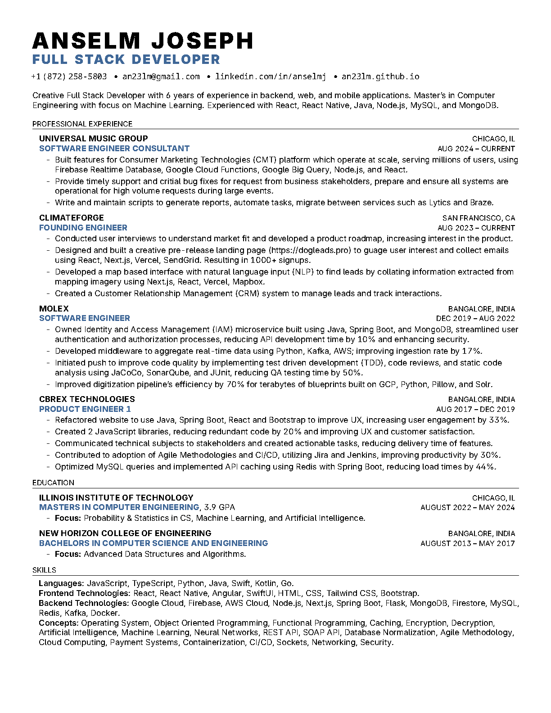

# Anselm Joseph's Resume

### Setup (for Mac)
1. Install `macTeX` or `basicTeX`
2. Install `pdflatex` if required

#### Further setup For basicTeX
Update the tlmgr using the following command:
```bash
sudo tlmgr update --self
```
Install the following packages using `tlmgr` (sudo might be required):
- `latexindent`
- `latexmk`
- `preprint`
- `fullpage`
- `collection-fontsextra`
- `fullpage`
- `titlesec`
- `marvosym`
- `enumitem`
- `noto`
- `fontaxes`
- `inter`
- `greek-fontenc`
- `babel-greek`
- `cbfonts`

### Generating PDF
```bash
chmod +x build.sh
./build.sh
```

### Preview


### Plain Text
Here's what the resume looks like for an ATS system:
```
ANSELM JOSEPH
FULL STACK DEVELOPER
+1 (872) 258-5803 • ajoseph17@hawk.iit.edu • linkedin.com/in/anselmj • an23lm.github.io
Creative Full Stack Developer with 5 years of experience in backend, web, and mobile applications. Master’s in Computer
Engineering with focus on Machine Learning. Experienced with React, React Native, Java, Node.js, MySQL, and MongoDB. EDUCATION
 - ILLINOIS INSTITUTE OF TECHNOLOGY MASTERS IN COMPUTER ENGINEERING, 3.9 GPA
- Focus: Probability & Statistics in CS, Machine Learning, and Artificial Intelligence.
- NEW HORIZON COLLEGE OF ENGINEERING
BACHELORS IN COMPUTER SCIENCE AND ENGINEERING
- Focus: Advanced Data Structures and Algorithms. SKILLS
CHICAGO, IL EXPECTED MAY 2024
BANGALORE, INDIA AUGUST 2013 – MAY 2017
 Languages: JavaScript, TypeScript, Python, Java, Swift, Kotlin, Go.
Frontend Technologies: React, React Native, Angular, SwiftUI, HTML, CSS, Tailwind CSS, Bootstrap.
Backend Technologies: Google Cloud, Firebase, AWS Cloud, Node.js, Next.js, Spring Boot, Flask, MongoDB, Firestore, MySQL, Redis, Kafka, Docker.
Concepts: Operating System, Object Oriented Programming, Functional Programming, Caching, Encryption, Decryption, Artificial Intelligence, Machine Learning, Neural Networks, REST API, SOAP API, Database Normalization, Agile Methodology, Cloud Computing, Payment Systems, Containerization, CI/CD, Sockets, Networking, Security.
PROFESSIONAL EXPERIENCE
- DOGLEADS CHICAGO, IL FOUNDING ENGINEER AUG 2023 – CURRENT
- Conducted user interviews to understand market fit and developed a product roadmap, increasing interest in the product.
- Designed and built a creative pre-release landing page to guage user interest and collect emails using React, Next.js,
Vercel, SendGrid. Resulting in 1000+ signups.
- Developed a map based interface with naturual language input (NLP) to find leads by collating information extracted from
mapping imagery using Next.js, React, Vercel, Mapbox.
- Created a Customer Relationship Management (CRM) system to manage leads and track interactions.
- MOLEX BANGALORE, INDIA SOFTWARE ENGINEER DEC 2019 – AUG 2022
- Owned Identity and Access Management (IAM) microservice built using Java, Spring Boot, and MongoDB, streamlined user authentication and authorization processes, reducing API development time by 10% and enhancing security.
- Developed middleware to aggregate real-time data using Python, Kafka, AWS; improving ingestion rate by 17%.
- Iniated push to improve code quality by implementing test driven development (TDD), code reviews, and static code
analysis using JaCoCo, SonarQube, and JUnit, reducing QA testing time by 50%.
- Improved digitization pipeline’s efficiency by 70% for terabytes of blueprints built on GCP, Python, Pillow, and Solr.
- CBREX TECHNOLOGIES BANGALORE, INDIA PRODUCT ENGINEER 1 AUG 2017 – DEC 2019
- Refactored website to use React and Bootstrap to provide excellent UX, improving user engagement by 33%.
- Created 2 JavaScript libraries, reducing redundant code by 20% and improving UX and customer satisfaction.
- Communicated technical subjects to stakeholders and created actionable tasks, reducing delivery time of features.
- Contributed to adoption of Agile Methodologies and CI/CD, utilizing Jira and Jenkins, improving productivity by 30%. - Optimized MySQL queries and implemented API caching using Redis with Spring Boot, reducing load times by 44%.
PROJECTS
- NOBIAS INVESTING – React Native, Typescript, Swift, Java, GitLab CI/CD
- Balanced between UX and performance on information-rich screens through a process of continuous improvement. - Widespread device compatibility was prioritized and ensured reliability and responsiveness on low-end networks.
- EARTHEN SHADE – React.js, Next.js, Vercel, Firebase, GCP, Typescript, Tailwind CSS
- Designed and developed an e-commerce platform, finding balance between technical robustness and business impact,
iterating with feedback from stakeholders and customers.
- Implemented a real-time chat feature using WebSocket and Socket.io, enhancing user engagement and reducing response
time by 20%.
- DIGITAL LIFE CERTIFICATE - BANGALORE DEVELOPMENT AUTHORITY – HTML, JavaScript, Tailwind CSS, Python, Docker
- Implemented secure facial recognition and liveness detection and generated identifiable and tamper proof PDF documents.
- Ensured highly secure, testable, and well documented code with 100% code coverage that passed security audits by 2
  independent security agencies.
```

### Feedback
I'm not an expert at LaTeX, this is my first work with LaTeX. Feedback is always welcome. If you have any to give, [create an issue on GitHub](https://github.com/an23lm/resume/issues).

#### Known Issues
- Some words in plain text use special characters which are not expected. Example: `Artificial Intelligence` should be `Artificial Intelligence` - [GitHub Issue #1](https://github.com/an23lm/resume/issues/1)

### Inspiration
Before this I used Pages to create my resume. I noticed that it was not ATS friendly. So I decided to create a LaTeX resume which is ATS friendly and looks professional.

This resume was inspired by [Jake's Resume](https://www.overleaf.com/latex/templates/jakes-resume-anonymous/cstpnrbkhndn) on Overleaf.
https://www.overleaf.com/latex/templates/jakes-resume-anonymous/cstpnrbkhndn

### License
Unlicense
